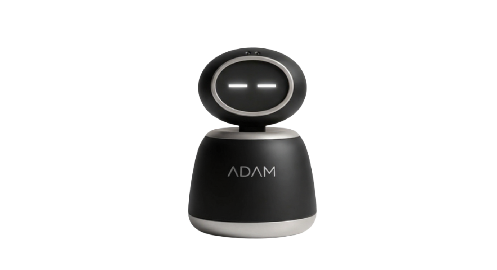

# ADAM — Autonomous Desktop AI Module

<div align="center">



### *Embodied Multimodal Intelligence on Your Desk*

[](LICENSE)
[](https://www.python.org/)
[](https://ai.google.dev/)
[](#hardware-architecture)
[](https://dgentechnologies.com)
[](https://github.com/MrTG1B)

[**System Architecture**](docs/architecture/system-architecture.md) &nbsp;•&nbsp;
[**Master Pinout**](docs/hardware/pinout.md) &nbsp;•&nbsp;
[**Hardware Setup**](docs/hardware/raspberry-pi.md) &nbsp;•&nbsp;
[**Host Software**](software/pi/README.md) &nbsp;•&nbsp;
[**Companion Apps**](apps/README.md) &nbsp;•&nbsp;
[**Contributing**](CONTRIBUTING.md)

</div>

---

## 🌟 Executive Overview

**ADAM (Autonomous Desktop AI Module)** is a cutting-edge embodied AI companion robot engineered and developed by **[Dgen technologies](https://dgentechnologies.com)**, led by creator and contributor **[Tirthankar Dasgupta](https://github.com/MrTG1B)**.

Unlike traditional smart speakers or screen-bound voice assistants, ADAM unifies **cloud-scale multimodal intelligence** with **physical robotic embodiment**. Powered by the **Google Gemini Live API**, ADAM engages in natural, full-duplex conversational voice interactions with sub-second latency, perceives real-world visual context through an onboard vision sensor, tracks human presence mechanically using dual-microphone acoustic sound localization, and conveys rich emotional nuance through fluid vector-rendered digital eyes.

Designed as an autonomous desktop companion, an intelligent workstation orchestrator, and an extensible robotics research platform, ADAM bridges the physical and digital worlds seamlessly.

---

## 👨‍💻 Creator & Engineering Leadership

ADAM is designed, engineered, and maintained by **Dgen technologies** with primary architecture and development by:

- **Lead Creator & Contributor**: **Tirthankar Dasgupta**  
  GitHub: [@MrTG1B](https://github.com/MrTG1B)  
  *Robotics Architecture, Multimodal Streaming Pipelines, Embedded Hardware & Signal Processing.*

- **Organization**: **Dgen technologies Pvt. Ltd.** (Kolkata, India)  
  Website: [dgentechnologies.com](https://dgentechnologies.com)  
  Mission: *"Innovate. Integrate. Inspire." | Made with pride in India.*

---

## ✨ Key Technical Innovations (v40)

| Capability | Engineering Realization |
| :--- | :--- |
| **Bidirectional Live Voice** | Full-duplex audio streaming over persistent WebSockets to **Gemini Multimodal Live**, featuring sub-second response times and immediate barge-in / interruption handling. |
| **I2S Subprocess Audio Pipeline** | Driven via ALSA `arecord` (`S32_LE`, 48kHz stereo) and `aplay` (`S16_LE`, 48kHz stereo) pipes. Survives I2S driver wedges without crashing the Python interpreter. |
| **Dynamic Channel Liveness** | Continuous acoustic dynamic range tracking (`_MicChannelLiveness`). Automatically isolates and drops defective channels (e.g. Vero board right mic hiss) to recover **11.7–21 dB of consonant SNR**. |
| **Adaptive Quorum VAD** | Room-learned spectral flatness gate with **3-of-6 chunk onset quorum** (100 ms voiced speech within 200 ms) and asymmetric floor tracking (`rise=0.02`, `fall=0.25`). |
| **Expressive Vector Eyes** | Dedicated **Raspberry Pi Pico (RP2040)** rendering 60 FPS vector eye and mouth animations across 14 emotional states on a 2.4" **ST7789** IPS display. |
| **Vision & Duty-Cycled Optics** | Hardware-accelerated **ESP32-CAM (OV2640)** streaming compressed JPEG frames over high-speed UART (921,600 baud) with intelligent thermal duty-cycling. |
| **Acoustic Servo Decoupling** | Closed-loop pan actuation on GPIO 12 with an automatic 0.6s detach state machine that prevents motor PWM hum from leaking into the microphones. |
| **Capacitive Touch Matrix** | Four **TTP223** touch sensors (cheeks, head, chin) configured in momentary mode with 3-sample majority voting and 60ms debounce. |
| **Local Companion Agent** | Distributed LAN-based **Laptop Agent** exposing system controls (volume, brightness, application launching, Spotify) via self-describing REST and mDNS. |
| **Persistent Contextual Memory** | Local JSON & vector-backed long-term memory store allowing ADAM to recall personal user preferences, past conversations, and facts. |

---

## 🏛️ System Architecture

ADAM utilizes a **distributed micro-tier architecture** that offloads hard real-time tasks to specialized microcontrollers, ensuring responsive execution without thermal throttling:

```
                                  ┌───────────────────────────┐
                                  │ Google Gemini Live Cloud  │
                                  │ (Bidirectional WebSockets)│
                                  └─────────────▲─────────────┘
                                                │ (WiFi / TLS)
                                                ▼
┌────────────────────────────────────────────────────────────────────────────────────────────────┐
│  TIER 1: RASPBERRY PI ZERO 2 W (Orchestration & Voice Brain)                                  │
│                                                                                                │
│   INMP441 Dual Mics ──▶ [arecord (S32_LE)] ──▶ [WOLA / FIR / Quorum VAD] ──▶ Pan Servo (GPIO12)│
│   Gemini Voice Out   ──▶ [aplay (S16_LE)]   ──▶ MAX98357A I2S Amp ──▶ 3W Speaker               │
│   Vosk Offline Engine (Wake-word) & Persistent Memory Store                                    │
└───────────────────────────────────────────────┬────────────────────────────────────────────────┘
                                                │ PL011 UART (/dev/serial0 @ 921,600 baud)
                                                ▼
┌────────────────────────────────────────────────────────────────────────────────────────────────┐
│  TIER 2: ESP32-CAM (Vision, Touch, Tilt & Peripheral Relay)                                   │
│                                                                                                │
│   OV2640 Camera ──▶ [Hardware JPEG] ──▶ UART2 ──▶ Sent to Pi                                  │
│   4x TTP223 Touch Pads ──▶ [Majority-Vote Debounce] ──▶ UART2 ──▶ Sent to Pi                  │
│   Tilt Servo ◀── GPIO13 PWM (Inbound TILT commands from Pi)                                    │
└───────────────────────────────────────────────┬────────────────────────────────────────────────┘
                                                │ UART1 (GPIO3 TX @ 115,200 baud, One-Way Relay)
                                                ▼
┌────────────────────────────────────────────────────────────────────────────────────────────────┐
│  TIER 3: RASPBERRY PI PICO RP2040 (Expressive Digital Face)                                    │
│                                                                                                │
│   Inbound Emotion Commands (ASCII: happy, idle, thinking, rizz, etc.)                          │
│   ST7789 2.4" 320x240 Display ◀── SPI Bus @ 40 MHz (Double-Buffered RGB565 Vector Engine)     │
└────────────────────────────────────────────────────────────────────────────────────────────────┘
```

For complete technical specifications, see:
- [**System Architecture Specification**](docs/architecture/system-architecture.md)
- [**Data Flow & Protocol Breakdown**](docs/architecture/data-flow.md)
- [**Hardware & Power Distribution Architecture**](docs/architecture/hardware-architecture.md)

---

## 📁 Repository Structure

```text
ADAM AI/
├── README.md                            # Primary project landing page (this file)
├── LICENSE                              # Apache 2.0 open-source license
├── CONTRIBUTING.md                      # Contribution and coding guidelines
├── .gitignore                           # Git ignore rules for Python, C++, and builds
├── .env.example                         # Production-verified configuration template
│
├── docs/                                # Technical documentation
│   ├── architecture/
│   │   ├── system-architecture.md       # Multi-tier computing model & topology
│   │   ├── data-flow.md                 # End-to-end data lifecycle & binary packet protocols
│   │   └── hardware-architecture.md     # Power distribution, measured draws & fault remedies
│   ├── hardware/
│   │   ├── raspberry-pi.md              # Debian 13 bring-up, voiceHAT I2S & PL011 UART
│   │   ├── esp32-cam.md                 # ESP32-CAM firmware, camera duty-cycling & touch
│   │   ├── pico-display.md              # RP2040 MicroPython ST7789 vector engine
│   │   └── pinout.md                    # Consolidated master pinout cross-reference
│   └── development/
│       └── development-guide.md         # Diagnostic scripts, log reading & triage reference
│
├── software/                            # Production source code
│   ├── pi/                              # Raspberry Pi main orchestrator daemon
│   │   ├── README.md                    # Setup and daemon architecture
│   │   ├── requirements.txt             # Pip dependency manifest
│   │   ├── adam.service                 # Production systemd daemon unit with DNS gate
│   │   └── src/                         # Core Python modules & audio diagnostic tools
│   ├── esp32-cam/                       # ESP32-CAM Arduino C++ firmware
│   │   ├── README.md                    # Arduino IDE & board configuration
│   │   └── src/esp32_cam.ino            # Dual-UART firmware with touch filter
│   ├── pico/                            # Raspberry Pi Pico MicroPython face engine
│   │   ├── README.md                    # MicroPython runtime guide
│   │   └── src/main.py                  # 60 FPS vector face renderer (14 emotions)
│   └── laptop-agent/                    # Python companion host agent
│       ├── README.md                    # Modular action registry & LAN mDNS guide
│       ├── requirements.txt             # Companion agent dependencies
│       └── src/laptop_agent.py          # Extensible REST action server
│
├── apps/                                # Companion user applications
│   ├── README.md                        # Application suite documentation
│   ├── pc/                              # React 18 + Vite + Tailwind PC Dashboard
│   └── mobile/                          # Turborepo + Expo React Native Mobile App
│
├── assets/                              # Media, blueprints & brand assets
│   ├── images/                          # Schematics, high-res renders, photo diagrams
│   └── videos/                          # 3D animation renders and video demos
│
└── examples/                            # Testing utilities & developer recipes
    ├── README.md                        # Examples overview and running instructions
    ├── mock_esp32_serial.py             # Hardware-free serial link simulator
    ├── custom_action_plugin.py          # Laptop Agent extension recipe
    └── test_audio_doa.py                # Standalone sound localization verification
```

---

## 🛠️ Hardware Bill of Materials (BOM)

| Component | Part / Model | Purpose | Voltage / Interface |
| :--- | :--- | :--- | :--- |
| **Main Processing Brain** | Raspberry Pi Zero 2 W (or Pi 4B) | Gemini Live client, DSP, orchestrator | 5V / 2.5A, Wi-Fi 802.11 b/g/n |
| **Vision & Touch Node** | ESP32-CAM (AI-Thinker) + OV2640 | Hardware JPEG camera, capacitive touch | 5V / 1A, UART2 (PL011) |
| **Digital Face Display** | Raspberry Pi Pico (RP2040) | MicroPython vector animation engine | 5V (VBUS) / 3.3V OUT, SPI 40MHz |
| **Display Panel** | 2.4" IPS TFT (ST7789 controller) | 320x240 RGB eye/mouth animation display | 3.3V, SPI bus |
| **Audio Input** | 2x INMP441 MEMS Microphones | Stereo audio capture & GCC-PHAT DOA | 3.3V, I2S bus (voiceHAT) |
| **Audio Output** | MAX98357A I2S Class-D DAC + 3W Speaker | High-clarity speech playback | 5V / 3.3V logic, I2S bus |
| **Actuators** | 2x SG90 / MG90S Micro Servos | Pan (yaw) and Tilt (pitch) head movement | 5V, 50Hz PWM |
| **Touch Sensors** | 4x TTP223 Capacitive Modules | Cheeks, forehead, chin physical inputs | 3.3V, Digital GPIO |
| **Power Distribution** | 5V 5A Synchronous Buck Converter | Regulated star power delivery | 7V-24V in -> 5.0V out |

For complete connection schematics and wiring matrices, refer to [**Master Pinout Reference**](docs/hardware/pinout.md).

---

## 📖 Technical Documentation & Bring-Up Guides

Detailed step-by-step technical guides are organized in the [`docs/`](docs/) directory:

- **[System Architecture](docs/architecture/system-architecture.md)**: Multi-tier computing model, ALSA subprocess pipe design, and fault recovery.
- **[Data Flow & Protocols](docs/architecture/data-flow.md)**: Full-duplex audio stream, binary UART framing, and emotion relay sequence.
- **[Hardware Architecture](docs/architecture/hardware-architecture.md)**: Power rails, measured electrical current draws, decoupling, and hardware fault remedies.
- **[Raspberry Pi Bring-Up](docs/hardware/raspberry-pi.md)**: Operating system provisioning (Debian 13 Trixie), device tree overlays, and systemd service setup.
- **[ESP32-CAM Guide](docs/hardware/esp32-cam.md)**: Arduino C++ firmware flashing, dual-UART configuration, and touch debouncing.
- **[Pico Display Guide](docs/hardware/pico-display.md)**: MicroPython runtime setup, SPI display driver, and vector emotion engine.
- **[Master Pinout Reference](docs/hardware/pinout.md)**: Complete cross-hardware pin connections table.
- **[Development & Diagnostics](docs/development/development-guide.md)**: Audio diagnostic suite (`mic_probe.py`, `mic_modes.py`, etc.), log analysis, and troubleshooting.

---

## 💻 Companion Software & Applications

ADAM is supported by a comprehensive application ecosystem:
- **PC Dashboard ([`apps/pc`](apps/pc))**: React 18 + Vite + Tailwind desktop control interface for monitoring live telemetry, conversation transcripts, and hardware actuation.
- **Mobile App ([`apps/mobile`](apps/mobile))**: Turborepo monorepo with Expo / React Native for BLE Wi-Fi onboarding, persona selection, and remote teleoperation.
- **Laptop Agent ([`software/laptop-agent`](software/laptop-agent))**: Workstation background service exposing audio volume, display brightness, screen lock, and media playback to Gemini function calling.

Learn more in [**Companion Apps Guide**](apps/README.md).

---

## 🤝 Contributing

We welcome contributions from robotics engineers, AI researchers, and developers. Please review our [**Contributing Guide**](CONTRIBUTING.md) to get started with coding conventions and hardware testing protocols.

---

## ⚖️ License

ADAM AI is released under the **[Apache 2.0 License](LICENSE)**.  
Copyright &copy; 2026 **Dgen technologies Pvt. Ltd.**

Commercial licensing, custom hardware integrations, and OEM deployments are available. For enterprise inquiries, contact **contact@dgentechnologies.com**.

---

## 🏢 Built by Dgen technologies

**Dgen technologies Pvt. Ltd.** — Kolkata, India  
*"Innovate. Integrate. Inspire." | Made with pride in India.*

- **Official Website**: [dgentechnologies.com](https://dgentechnologies.com)
- **Lead Creator / Contributor**: [Tirthankar Dasgupta (@MrTG1B)](https://github.com/MrTG1B)
- **Twitter / X**: [@dgen_tec](https://twitter.com/dgen_tec)
- **Instagram**: [@dgen_technologies](https://instagram.com/dgen_technologies)
- **LinkedIn**: [Dgen technologies](https://linkedin.com/company/dgentechnologies)
