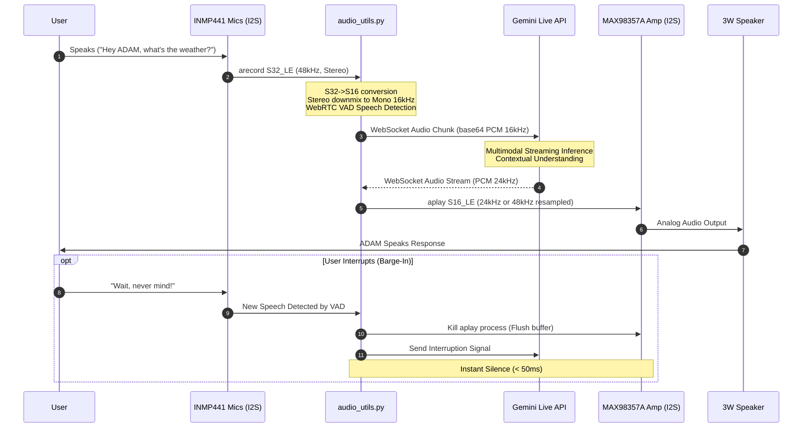
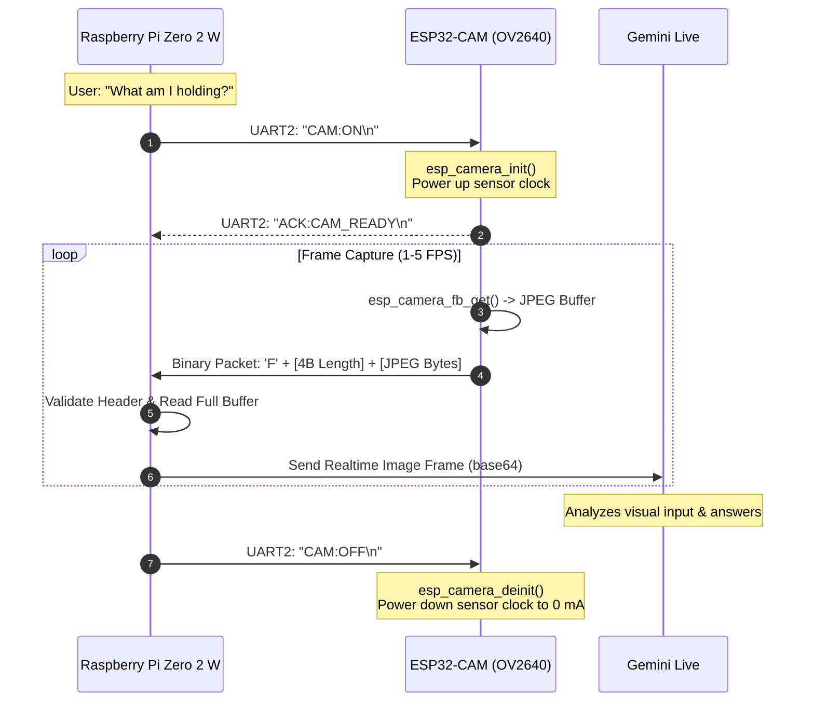
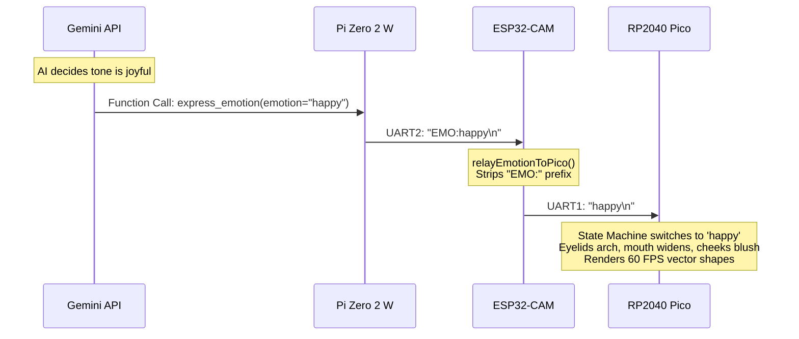

# ADAM Data Flow & Communication Protocols

This document details the end-to-end data lifecycle, packet schemas, and communication protocols across ADAM's subsystems.

---

## 1. Bidirectional Voice Pipeline



### Audio Format Standards
- **Capture Format (Hardware ALSA)**: `S32_LE`, 48,000 Hz, 2 Channels (Stereo).
- **Processing DSP**: Converted via NumPy slicing and bit-shifting:
  ```python
  # S32_LE to S16_LE conversion:
  samples_32 = np.frombuffer(raw_data, dtype=np.int32)
  # Take channel 0 (or average) and shift down 16 bits
  samples_16 = (samples_32[0::2] >> 16).astype(np.int16)
  ```
- **Gemini Ingest**: Raw 16-bit linear PCM, 16,000 Hz, Single Channel (Mono).
- **Gemini Egress**: Raw 16-bit linear PCM, 24,000 Hz, Mono. Resampled on-the-fly to 48,000 Hz for the Google voiceHAT ALSA playback pipe.

---

## 2. Vision Pipeline & Duty-Cycling

To prevent sensor overheating and unnecessary power draw, the camera pipeline is on-demand:



### Binary UART Framing Specification
The Pi-to-ESP32 serial link operates over a custom binary protocol on `/dev/serial0` (921,600 baud, 8N1):

#### Camera Frame Packet (ESP32 -> Pi)
```text
Offset | Field           | Type          | Description
-------+-----------------+---------------+-----------------------------------------
0x00   | Header Magic    | uint8 (char)  | ASCII 'F' (0x46)
0x01   | Payload Length  | uint32 (BE)   | 4-byte big-endian length of JPEG data
0x05   | Image Payload   | bytes         | Raw compressed JPEG file stream
0x05+L | Checksum / End  | uint8 (char)  | ASCII '\n' delimiter
```

#### Touch Event Packet (ESP32 -> Pi)
```text
ASCII Line: "T<pad_number>:<state>\n"
Example:    "T1:1\n"  (Touch Pad 1 Pressed)
            "T1:0\n"  (Touch Pad 1 Released)
```

#### Gesture Event Packet (ESP32 -> Pi)
```text
ASCII Line: "G:<gesture_name>\n"
Example:    "G:PET\n"   (Petting gesture across top sensors)
            "G:TAP\n"   (Quick double tap)
```

#### Actuation & Control Commands (Pi -> ESP32)
```text
"TILT:<degrees>\n"      # Set tilt servo angle (45 - 135 deg)
"CAM:ON\n"              # Power up camera sensor
"CAM:OFF\n"             # Power down camera sensor
"EMO:<emotion_name>\n"  # Inbound emotion state to relay to Pico
```

---

## 3. Direction-of-Arrival (DOA) Sound Localization

ADAM uses dual omnidirectional INMP441 MEMS microphones separated by a known baseline distance ($d = 65\text{ mm}$) to calculate sound origin angle $\theta$ and orient its physical head:

```mermaid
graph LR
    MicL[Left Mic INMP441] --> S32L[Stereo S32 Stream]
    MicR[Right Mic INMP441] --> S32R[Stereo S32 Stream]
    S32L & S32R --> FFT[Cross-Spectral Density FFT]
    FFT --> PHAT[Phase Transform Normalization]
    PHAT --> IFFT[Inverse FFT: GCC-PHAT Cross-Correlation]
    IFFT --> Peak[Peak Detection -> Time Delay Tau]
    Peak --> Angle[Theta = arcsin(c * Tau / d)]
    Angle --> Servo[gpiozero AngularServo: Pan Angle]
```

### Mathematical Formulation
1. **Cross-Correlation**:
   $$\text{GCC-PHAT}(t) = \mathcal{F}^{-1}\left( \frac{X_1(f) X_2^*(f)}{|X_1(f) X_2^*(f)|} \right)$$
2. **Time Delay ($\tau$)**:
   $$\tau = \arg\max_t (\text{GCC-PHAT}(t))$$
3. **Angle Calculation**:
   $$\theta = \arcsin\left( \frac{c \cdot \tau}{d} \right)$$
   Where $c = 343\text{ m/s}$ (speed of sound) and $d = 0.065\text{ m}$.

---

## 4. Emotional Expression & Display Pipeline

The emotion pipeline links Gemini's conversational intent to the physical facial rendering on the Raspberry Pi Pico:



### Supported Emotion Tokens
- `idle`: Default calm state with lifelike subtle eye drifts and periodic blinks.
- `speaking`: Synchronized mouth pulses and vibrant animated eyes.
- `happy`: Arched upper eyelids, wide curved smile, and pink blush cheeks.
- `sad`: Drooping eyelids, downward curved mouth, deep blue hue.
- `angry`: Sharp angled inner brows, compressed mouth, fiery red tint.
- `panic`: Rapid horizontal saccadic eye darts with oscillating pupil sizes.
- `surprised`: Wide circular pupils, dropped oval mouth.
- `shy`: Downcast eyes looking away with soft pink cheek highlights.
- `sleep`: Closed eyelids (horizontal slits) with slow breathing animation.
- `thinking`: Eyes tilted upward toward corner with pulsing eyebrow indicator.
- `reconnecting`: Amber pulsing ring indicating network handshake in progress.
- `love`: Heart-shaped pupil vector transitions.
- `confused`: Asymmetrical eyebrows with tilted pupils.
- `rizz`: Winking left eyelid with confident grin.
