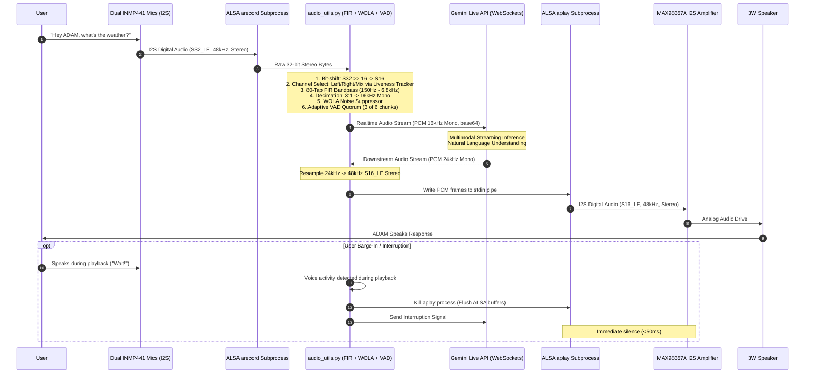
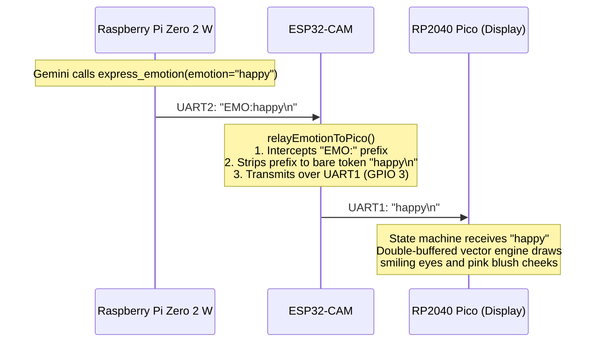

# ADAM Data Flow & Communication Protocols (v40)

This document details the end-to-end data lifecycle, binary framing specifications, serial command protocols, and digital signal processing pipelines across ADAM's subsystems.

---

## 1. End-to-End Audio & Voice Pipeline



---

## 2. Audio Processing & DSP Specifications

### Input Audio Conversion
- **ALSA Hardware Capture**: `arecord -D plughw:sndrpigooglevoi,0 -f S32_LE -r 48000 -c 2`
- **S32_LE to S16_LE Conversion**:
  ```python
  samples_32 = np.frombuffer(raw_chunk, dtype=np.int32)
  # Hardware alignment: INMP441 places 24-bit data in the upper bits of a 32-bit slot
  samples_16 = (samples_32 >> 16).astype(np.int16)
  ```

### Dynamic Channel Selection (`_MicChannelLiveness`)
- Analyzes the first-difference RMS ($d = \Delta x$) over a 90-second sliding window.
- Computes dynamic range per channel: $DR = 20 \cdot \log_{10}(p99 / p20)$.
- If one channel has a hardware fault ($DR < 3.0\text{ dB}$ while the other channel has $DR > 8.0\text{ dB}$), ADAM automatically drops the dead channel from the speech path. This prevents white noise averaging from destroying consonant intelligibility.

### Anti-Aliasing & Decimation
- Speech is filtered using an **80-tap windowed-sinc FIR filter** with transition band edges at 150 Hz and 6800 Hz.
- Decimated by a factor of 3 ($48000\text{ Hz} \rightarrow 16000\text{ Hz}$). The stopband attenuation exceeds 60 dB at the 8000 Hz Nyquist boundary, preventing high-frequency aliasing from corrupting sibilants and fricatives.

### Adaptive VAD & Floor Estimation
- **Learned Noise Floor**: Tracked as the 20th percentile ($p20$) of a 45-second window.
- **Asymmetric Floor Adjustment**:
  - `MIC_FLOOR_RISE = 0.02` (~8s to adapt upward to rising room noise).
  - `MIC_FLOOR_FALL = 0.25` (~0.7s to adapt downward to quiet rooms).
- **Onset Quorum**: Requires at least **3 passing chunks out of the last 6 chunks** (100 ms of voiced energy inside a 200 ms window). This allows unvoiced consonants and stop closures to pass without resetting the onset detector.
- **Turn-Taking Hangover**: `MIC_VAD_HANGOVER_S = 1.0` seconds ensures mid-sentence clause pauses do not prematurely trigger Gemini's turn completion.

---

## 3. High-Speed Serial Framing Protocol (`/dev/serial0`)

The link between the Raspberry Pi and the ESP32-CAM operates over the PL011 hardware UART at **921,600 baud, 8 data bits, no parity, 1 stop bit (8N1)**.

### A. Camera Frame Binary Packet (ESP32-CAM -> Pi)
```text
Byte Offset | Field            | Data Type     | Value / Description
------------+------------------+---------------+------------------------------------
0x00        | Magic Identifier | uint8 (char)  | ASCII 'F' (0x46)
0x01..0x04  | Payload Length   | uint32 (BE)   | 4-byte big-endian JPEG size (L)
0x05..0x04+L| Image Data       | bytes         | Raw binary JPEG compressed stream
0x05+L      | Frame Delimiter  | uint8 (char)  | ASCII '\n' (0x0A)
```

### B. Touch Event Packets (ESP32-CAM -> Pi)
Dispatched whenever a debounced capacitive touch state changes:
```text
"T<pad_id>:<state>\n"

Examples:
  "T1:1\n"    -> Touch Pad 1 (Left Cheek) PRESSED
  "T1:0\n"    -> Touch Pad 1 (Left Cheek) RELEASED
  "T2:1\n"    -> Touch Pad 2 (Right Cheek) PRESSED
  "T3:1\n"    -> Touch Pad 3 (Head / Forehead) PRESSED
  "T4:1\n"    -> Touch Pad 4 (Petting Pad) PRESSED
```

### C. Gesture Event Packets (ESP32-CAM -> Pi)
```text
"G:<gesture_type>\n"

Examples:
  "G:PET\n"   -> Petting sequence across consecutive head pads
  "G:TAP\n"   -> Rapid double-tap event
```

### D. Host Control Commands (Pi -> ESP32-CAM)
```text
Command String     | Function
-------------------+-------------------------------------------------------------
"CAM:ON\n"         | Power up OV2640 sensor clock & start JPEG transmission
"CAM:OFF\n"        | De-initialize OV2640 sensor to eliminate thermal dissipation
"TILT:<angle>\n"   | Set tilt servo angle in degrees (e.g. "TILT:85\n")
"EMO:<emotion>\n"  | Send emotion state to relay to Pico (e.g. "EMO:happy\n")
```

---

## 4. Pico Emotion Relay Protocol (ESP32-CAM -> Pico)

The ESP32-CAM relays emotion updates to the Raspberry Pi Pico over `UART1` (`GPIO 3` TX -> `GP1` RX @ 115,200 baud):



### Supported Emotion Tokens:
`idle`, `speaking`, `happy`, `sad`, `angry`, `panic`, `surprised`, `shy`, `sleep`, `thinking`, `reconnecting`, `love`, `confused`, `rizz`.

---

## 5. Direction-of-Arrival (DOA) Tracking Pipeline

When both microphones are healthy, ADAM localizes voice azimuth using GCC-PHAT:

```text
Mic 1 (Left)  ──▶ [48kHz S16] ──┐
                                 ├──▶ [Cross-Spectral Density FFT] ──▶ [PHAT Normalization]
Mic 2 (Right) ──▶ [48kHz S16] ──┘                                            │
                                                                             ▼
                                                                [Inverse FFT (GCC-PHAT)]
                                                                             │
                                                                             ▼
                                                                [Peak Lag -> Delay Tau]
                                                                             │
                                                                             ▼
                                                   [Azimuth Theta = arcsin(c * Tau / d)]
                                                                             │
                                                                             ▼
                                                            [gpiozero Pan Servo Update]
```

### Mechanical Settle Guard:
To ensure servo movement noise does not corrupt speech recognition:
1. Target angle is clamped to a 12° deadzone (`NECK_PAN_DEADZONE_DEG=12`).
2. Minimum move interval is enforced (`NECK_PAN_COOLDOWN_S=1.5`).
3. Servo PWM is driven for `NECK_SERVO_HOLD_S=0.6s`, then released (`detach()`).
4. Gate opening is temporarily held during the 2.0s settling window (`NECK_SERVO_SETTLE_S=2.0s`).
