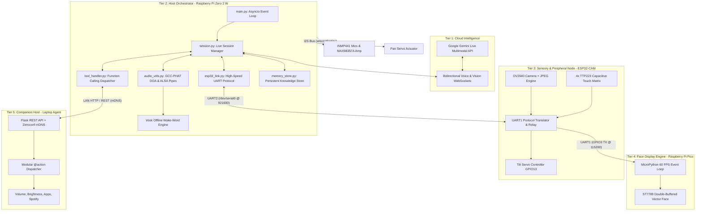

# ADAM System Architecture Specification

## 1. Executive Summary

**ADAM (Autonomous Desktop AI Module)** utilizes a **distributed micro-tier architecture**. Rather than running monolithic computation on a single resource-constrained processor or routing all sensory tasks through the cloud, ADAM partitions workloads across specialized silicon nodes based on timing requirements, hardware interfaces, and power envelopes.

This architecture ensures:
1. **Sub-second Latency**: Direct full-duplex WebSocket audio streaming to Google Gemini Live.
2. **Deterministic Hard Real-Time Timing**: Display rendering, PWM servo generation, and capacitive touch polling are decoupled from high-level operating system scheduling jitter.
3. **Thermal & Electrical Resilience**: Processing loads are isolated, preventing brownouts and thermal throttling on the host microcomputer.
4. **Graceful Degradation**: The system automatically operates in audio-only conversation mode if peripheral microcontrollers are disconnected or unpowered.

---

## 2. Multi-Tier Distributed Architecture

---

## 3. Tier-by-Tier Functional Breakdown

### Tier 1: Cloud Intelligence (Google Gemini Live)
- **Protocol**: Bidirectional WebSockets over TLS (`wss://generativelanguage.googleapis.com`).
- **Data Exchange**:
  - Inbound: Streaming raw 16kHz 16-bit mono PCM audio chunks, periodic base64 JPEG camera frames, and client function call responses.
  - Outbound: Streaming raw 24kHz PCM audio chunks, realtime text transcript fragments, and server function call triggers (`laptop_control`, `web_search`, `express_emotion`, `move_head`).
- **Interruption Model**: Built-in barge-in handling; whenever user speech is detected by the voice activity detector (VAD), ongoing audio playback is immediately halted.

### Tier 2: Edge Brain (Raspberry Pi Zero 2 W)
- **OS Environment**: Raspberry Pi OS 64-bit (Debian 13 Trixie), Linux kernel 6.18+.
- **Process Model**: Python 3.13 single-process asynchronous event loop powered by `asyncio`.
- **Audio Capture & DSP**:
  - Subprocess pipe to ALSA `arecord` capturing 48kHz stereo `S32_LE` from Google voiceHAT.
  - Downsampling & conversion to 16kHz mono `S16_LE` for Gemini ingest.
  - Direction of Arrival (DOA) computation using Generalized Cross-Correlation with Phase Transform (GCC-PHAT) across stereo channels.
- **Actuation**: Direct software PWM control on GPIO12 via `gpiozero.AngularServo` for horizontal panning.
- **Peripheral Bridge**: `esp32_link.py` running asynchronous framing and packet assembly over `/dev/serial0`.

### Tier 3: Peripheral Sub-Controller (ESP32-CAM)
- **Processor**: Dual-Core Tensilica Xtensa 32-bit LX6 @ 240MHz with 4MB external PSRAM.
- **Optics Management**:
  - OV2640 image sensor capturing QVGA/VGA JPEG compressed frames.
  - **Duty-Cycling**: The camera sensor remains powered down or de-initialized when visual analysis is unnecessary to eliminate thermal accumulation and power waste.
- **Capacitive Touch Filtering**:
  - 4x TTP223 digital inputs (Left Cheek, Right Cheek, Head/Pet, Chin).
  - 3-sample majority voting per 20ms poll cycle followed by a 60ms state-change debounce filter to eliminate spurious triggers.
- **Dual Hardware UART Routing**:
  - `UART2` (GPIO4 TX, GPIO16 RX): Full duplex communication with the Pi Zero 2 W at 921,600 baud.
  - `UART1` (GPIO3 TX): One-way ASCII protocol relay to the Raspberry Pi Pico at 115,200 baud.

### Tier 4: Digital Face Engine (Raspberry Pi Pico RP2040)
- **Processor**: Dual-Core ARM Cortex-M0+ @ 133MHz with 264KB SRAM.
- **Display Driver**: 2.4" ST7789 IPS LCD (320x240 pixels) connected via 4-wire SPI at 40MHz.
- **Graphics Engine**:
  - Zero-heap allocation procedural vector graphics engine written in MicroPython.
  - 153.6 KB statically pre-allocated RGB565 frame buffer (`bytearray(320 * 240 * 2)`) with byte-swapped endianness.
  - State machine supporting 14 expressive emotions: `idle`, `speaking`, `happy`, `sad`, `angry`, `panic`, `surprised`, `shy`, `sleep`, `thinking`, `reconnecting`, `love`, `confused`, and `rizz`.

### Tier 5: Companion Host (Laptop Agent)
- **Deployment**: Runs on the user's primary macOS, Windows, or Linux workstation.
- **Discovery**: Broadcasts an `_adam-agent._tcp.local.` service record via Zeroconf (mDNS) eliminating manual IP configuration.
- **Security Boundary**: Shared token authentication (`Authorization: Bearer <TOKEN>`) restricting commands to authorized local LAN devices.
- **Extensible Action Registry**: Python functions decorated with `@action(...)` automatically publish self-describing JSON schemas to ADAM's tool dispatcher.

---

## 4. Graceful Degradation & Fault Tolerance

To ensure commercial-grade reliability, ADAM is built to withstand partial subsystem disconnects:

| Failure Scenario | System Behavior | Recovery Mechanism |
| :--- | :--- | :--- |
| **ESP32-CAM Disconnected / Unpowered** | The Pi logs a warning on `/dev/serial0`. ADAM automatically boots into **Audio-Only Mode**. Face, touch, and camera tools are suppressed. Voice conversation remains 100% operational. | Background reconnect loop attempts UART handshake every 5 seconds. |
| **Internet / Gemini Disconnect** | Audio playback stops; Pico face transitions to the `reconnecting` emotion (pulsing amber eyes). Offline Vosk wake-word listener remains active. | Exponential backoff reconnect loop re-establishes the Gemini Live WebSocket. |
| **Laptop Agent Offline** | If the user requests workstation tasks ("mute laptop"), ADAM informs the user that the laptop companion is unreachable without crashing the session. | mDNS listener dynamically discovers agent when host laptop wakes or rejoins LAN. |
| **Microphone Overflow / Underrun** | ALSA ring buffers handle transient OS scheduling latencies. Audio DSP drops stale audio packets if queue exceeds 250ms threshold. | Frame counter synchronization prevents cumulative audio drift. |
