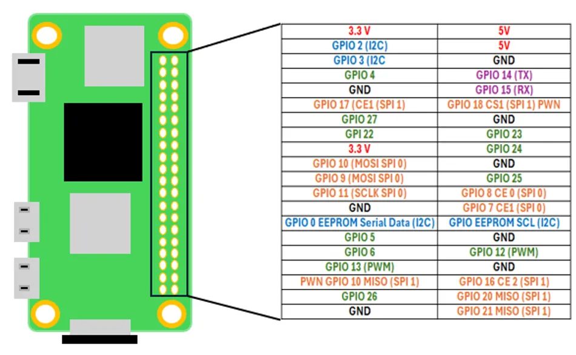

# ADAM Master Hardware Pinout Matrix (v40)

This document provides the authoritative, consolidated wiring cross-reference for all microprocessors, microcontrollers, and actuators across the ADAM system.

---

## 1. Raspberry Pi Zero 2 W (40-Pin GPIO Header)

  

| Physical Pin | Header Label | Function in ADAM | Connected Subsystem | Notes |
| :---: | :---: | :--- | :--- | :--- |
| **2** | **5V Power** | Main Logic Power Input | 5.0V Logic Rail (Buck Converter) | Stable regulated 5.0V supply |
| **4** | **5V Power** | Supplemental 5V Input | 5.0V Logic Rail | Paralleled with Pin 2 for lower IR drop |
| **6** | **GND** | System Ground | Central Star Ground Rail | Common ground reference |
| **8** | **GPIO 14 (TXD)** | UART2 Serial Transmit | **ESP32-CAM GPIO 16 (RX)** | PL011 UART @ 921,600 baud (8N1) |
| **10** | **GPIO 15 (RXD)** | UART2 Serial Receive | **ESP32-CAM GPIO 4 (TX)** | PL011 UART @ 921,600 baud (8N1) |
| **12** | **GPIO 18** | I2S BCLK (Bit Clock) | Google voiceHAT / INMP441 / MAX98357A | Shared I2S audio serial clock |
| **32** | **GPIO 12 (PWM0)**| Pan Servo PWM Signal | **Pan Servo (MG90S)** Signal Pin | `gpiozero.AngularServo` (50Hz PWM) |
| **35** | **GPIO 19** | I2S FS (Frame Sync / LRC) | Google voiceHAT / INMP441 / MAX98357A | Left/Right word framing clock |
| **38** | **GPIO 20** | I2S DIN (Data Input) | Google voiceHAT / INMP441 Mics | Stereo capture data line |
| **40** | **GPIO 21** | I2S DOUT (Data Output)| Google voiceHAT / MAX98357A Amp | Vocal playback data line |

---

## 2. ESP32-CAM (AI-Thinker) Pinout

| ESP32-CAM Pin | Connected Peripheral | Target Board / Pin | Mode / Electrical Spec | Function |
| :--- | :--- | :--- | :--- | :--- |
| **5V** | 5V Logic Rail | 5.0V Buck Output | 5.0V DC (Internal LDO) | Core power input |
| **GND** | System Ground | Central Star Ground | 0V Reference | Common ground |
| **GPIO 4** | UART2 Transmit (TX) | **Raspberry Pi GPIO 15 (RXD, Pin 10)** | 3.3V CMOS @ 921,600 baud | JPEG frames, touch & gesture events |
| **GPIO 16** | UART2 Receive (RX) | **Raspberry Pi GPIO 14 (TXD, Pin 8)** | 3.3V CMOS @ 921,600 baud | Control commands: `CAM:`, `TILT:`, `EMO:` |
| **GPIO 3 (U0RXD)**| UART1 Transmit (Relay)| **Raspberry Pi Pico GP1 (Pin 2)** | 3.3V CMOS @ 115,200 baud | Inbound emotion string relay |
| **GPIO 13** | Tilt Servo Signal | **Tilt Servo (SG90)** Signal Pin | 50Hz PWM Output | Vertical pitch actuation |
| **GPIO 12** | Touch Pad 1 Input | **Left Cheek** (TTP223 Output) | 3.3V Digital (Active HIGH) | Cheek tap sensing |
| **GPIO 14** | Touch Pad 2 Input | **Right Cheek** (TTP223 Output) | 3.3V Digital (Active HIGH) | Cheek tap sensing |
| **GPIO 15** | Touch Pad 3 Input | **Head / Stop** (TTP223 Output) | 3.3V Digital (Active HIGH) | Petting & stop attention trigger |
| **GPIO 2** | Touch Pad 4 Input | **Chin / Petting** (TTP223 Output) | 3.3V Digital (Active HIGH) | Petting gesture detection |

---

## 3. Raspberry Pi Pico (RP2040) Pinout

| Pico Pin | Physical Pin | Connected To | Interface | Electrical Spec | Purpose |
| :--- | :---: | :--- | :--- | :--- | :--- |
| **GP1** | **Pin 2** | **ESP32-CAM GPIO 3** | UART0 RX | 3.3V CMOS @ 115,200 baud | Inbound emotion tokens |
| **GP16** | **Pin 21** | **ST7789 DC** | Digital GPIO Output | 3.3V CMOS | Data / Command select |
| **GP17** | **Pin 22** | **ST7789 CS** | SPI0 Chip Select | 3.3V CMOS (Active LOW) | Display SPI chip enable |
| **GP18** | **Pin 24** | **ST7789 SCLK** | SPI0 Clock | 40 MHz SPI Clock | High-speed pixel clock |
| **GP19** | **Pin 25** | **ST7789 MOSI** | SPI0 Data (MOSI) | 3.3V CMOS | Framebuffer pixel data |
| **GP20** | **Pin 26** | **ST7789 RST** | Digital GPIO Output | 3.3V CMOS (Active LOW) | Hardware display reset |
| **3V3 OUT**| **Pin 36** | **ST7789 VCC & BL**| Power Rail Output | 3.3V DC (Pico onboard LDO) | Power for display & backlight |
| **GND** | **Pin 38** | **ST7789 GND** | System Ground | 0V Reference | Common ground |
| **VBUS** | **Pin 40** | **5V Logic Rail** | Power Rail Input | 5.0V DC | Powers Pico core voltage reg |

---

## 4. Servo Actuators Pinout

Both servos are powered strictly from the **Isolated 5V Actuator Rail**:

| Servo Function | Model | Power (VCC) | Ground (GND) | Signal (PWM) |
| :--- | :--- | :--- | :--- | :--- |
| **Pan Axis (Yaw)** | MG90S (Metal Gear) | 5V Actuator Rail | Central Star Ground | **Raspberry Pi GPIO 12 (Pin 32)** |
| **Tilt Axis (Pitch)**| SG90 (Micro Servo) | 5V Actuator Rail | Central Star Ground | **ESP32-CAM GPIO 13** |

---

## 5. Capacitive Touch Sensors (TTP223 Breakout)

| Touch Sensor | Location | Module VCC | Module GND | Module Output Pin | Jumper A |
| :--- | :--- | :--- | :--- | :--- | :--- |
| **Touch 1** | Left Cheek | 3.3V Rail | Star Ground | **ESP32-CAM GPIO 12** | **OPEN (Momentary)** |
| **Touch 2** | Right Cheek | 3.3V Rail | Star Ground | **ESP32-CAM GPIO 14** | **OPEN (Momentary)** |
| **Touch 3** | Head / Forehead | 3.3V Rail | Star Ground | **ESP32-CAM GPIO 15** | **OPEN (Momentary)** |
| **Touch 4** | Chin / Petting | 3.3V Rail | Star Ground | **ESP32-CAM GPIO 2** | **OPEN (Momentary)** |
